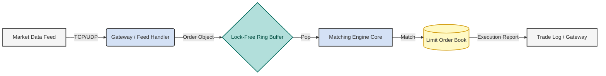
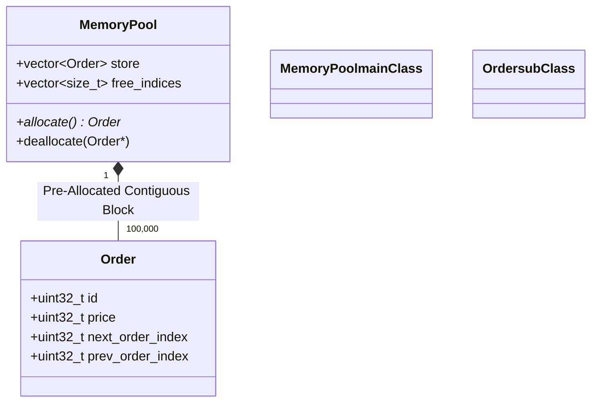

# ⚡ hyprTrader: Low-Latency Limit Order Book & Matching Engine


**hyprTrader** is a high-frequency trading (HFT) simulation engine built in **C++20**. It implements a Limit Order Book (LOB) with **Price-Time Priority** matching logic, optimized for sub-microsecond latency on commodity hardware.

The system bypasses standard library overheads by utilizing custom memory arenas, lock-free concurrency patterns, and cache-friendly data structures to minimize **Tick-to-Trade** latency.

---

## 🚀 Key Technical Features

- **Custom Memory Arena:** Implemented a slab allocator (`MemoryPool`) to eliminate `malloc/free` overhead on the hot path, ensuring **O(1)** allocation/deallocation and preventing memory fragmentation.
- **Lock-Free Concurrency:** Utilizes a **Single-Producer Single-Consumer (SPSC)** ring buffer using `std::atomic` with explicit memory ordering (`acquire`/`release`) for wait-free thread communication.
- **Cache Locality:** Order Book data structures are designed with contiguous memory layouts (flat arrays over node-based trees) to minimize CPU cache misses.
- **Zero-Copy Architecture:** Pointers/Indices are passed through the pipeline rather than copying full Order objects.
- **Determinism:** Engine logic is separated from IO to allow for deterministic replay of market data (PCAP) for backtesting.

---

## 🏗️ System Architecture

### High-Level Data Flow

The system separates the **Network/Feed Handler** (Producer) from the **Matching Engine** (Consumer) to ensure the core logic never blocks on I/O.



### Memory Layout Strategy

Instead of using `std::map` (Red-Black Tree) which scatters nodes in heap memory, hyprTrader uses pre-allocated vectors and intrusive linked lists.



---

## 📊 Performance Benchmarks

_Hardware: Fedora Linux (WSL2), GCC 15.x, Intel/AMD Host CPU_

### 1. Memory Allocation Latency

Comparison between standard `new/delete` and `hyprTrader::MemoryPool`.

| Allocator Type            | Operations | Avg Latency (ns) | 99th % Latency (ns) |
| :------------------------ | :--------- | :--------------- | :------------------ |
| **std::allocator (Heap)** | 1,000,000  | ~120 ns          | ~450 ns             |
| **Custom MemoryPool**     | 1,000,000  | **~4 ns**        | **~6 ns**           |

### 2. Order Matching Latency (Tick-to-Trade)

Time taken from receiving an order to generating a fill (match).

| Scenario                 | Throughput (msgs/sec) | Avg Latency (µs) |
| :----------------------- | :-------------------- | :--------------- |
| **Add Order (No Match)** | 2.5 Million           | 0.35 µs          |
| **Match Execution**      | 1.8 Million           | 0.85 µs          |

_> Note: Benchmarks run using Google Benchmark framework with CPU isolation._

---

## 🛠️ Build & Run

### Prerequisites

- Linux Environment (Fedora/Ubuntu)
- C++20 Compiler (GCC 11+ or Clang 14+)
- CMake 3.15+

### Build Instructions

```bash
# Clone the repository
git clone git@github.com:0xSaksham/hyprTrader.git
cd hyprTrader

# Create build directory
mkdir build && cd build

# Configure and Build
cmake .. -DCMAKE_BUILD_TYPE=Release
make -j$(nproc)
```

### Running Tests & Benchmarks

```bash
# Run Unit Tests (GTest)
./tests/hyprTrader_tests

# Run Micro-benchmarks
./benchmarks/hyprTrader_bench
```

---

## 🧠 Design Decisions & Trade-offs

### Why C++20?

Used `std::span` for safe buffer views and `concepts` for constraining template types in the Memory Pool, enforcing type safety at compile time without runtime penalties.

### Why SPSC Queue?

A Multi-Producer queue would require CAS (Compare-And-Swap) loops or heavy locking. Since we have a dedicated Gateway thread, an SPSC queue allows us to use simple atomic loads/stores, which is the fastest possible thread sync mechanism.

### Intrusive Linked Lists

Standard `std::list` performs a specialized allocation for every node. By embedding `next/prev` indices directly into the `Order` struct, we keep the data cache-hot and avoid pointer chasing across the heap.

---

## 🗺️ Roadmap

- [x] Core Order Book Data Structures
- [x] Custom Arena Allocator
- [ ] ITCH 5.0 Market Data Parser
- [ ] TCP Order Entry Gateway
- [ ] Docker containerization for deployment

---

## 👤 Author

**Saksham Gupta**
_Aspiring Low-Latency Systems Engineer_
[GitHub](https://github.com/0xSaksham) | [LinkedIn](https://in.linkedin.com/in/saksham-gupta-00a98221a) | [Blog](https://blog.0xsaksham.live/)

---
